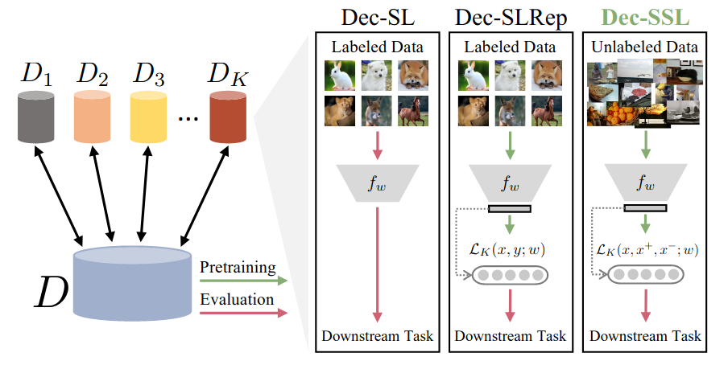

#  Does Decentralized Learning with non-IID Unlabeled Data Benefit from Self Supervision?
This is the PyTorch implementation of the [paper](https://arxiv.org/abs/2210.10947) "Does Decentralized Learning with non-IID Unlabeled Data Benefit from Self Supervision?".  


## Requirments
```
pip install -r requirements.txt
```

## Main Training Command
0. Centralized SSL experiment ```python src/centralized_ssl_main.py --dataset=cifarssl --gpu=0 --iid=0  --dirichlet --dir_beta 0.02```
1. Decentralized SSL experiment ```python src/decentralized_ssl_main.py --dataset=cifarssl --gpu=0 --iid=0  --dirichlet --dir_beta 0.02```
2. Decentralized SL experiment ```python src/decentralized_sl_main.py --dataset=cifarssl --gpu=0 --iid=0  --dirichlet --dir_beta 0.02```
3. Decentralized SL Representation experiment ```python src/decentralized_sl_repr_main.py --dataset=cifarssl --gpu=0 --iid=0  --dirichlet --dir_beta 0.02```
4. Decentralized Feature Alignment SSL experiment ```python src/decentralized_featarc_ssl_main.py --dataset=cifarssl --gpu=0 --iid=0  --dirichlet --dir_beta 0.02```


## Example Scripts on CIFAR
0. Run  Dirichlet non-i.i.d. SSL experiment with SimCLR scripts on CIFAR-10: 
```bash scripts/noniid_script/train_test_cifar_ssl_dir.sh```
1. Run  ablation study with Simsiam
```bash scripts/noniid_script/train_test_cifar_ssl_dir_simsiam.sh```
2. Run  distributed Training
```bash scripts/noniid_script/train_test_cifar_sl_dir_distributed.sh```
3. Run  training with ray
```bash scripts/noniid_script/train_test_cifar_ssl_skewpartition_ray.sh```


## ImageNet Experiment  
0.  Generate ImageNet-100 dataset for smaller-scale experiments. 
```python misc/create_imagenet_subset.py [PATH_TO_EXISTING_IMAGENET] [PATH_TO_CREATE_SUBSET]```

1. To launch as a batch job with two V100 gpus on a cluster
```bash scripts/imagenet_script/train_test_dec_ssl_imagenetfull_simclr_mpi.sh``` 

2. To train on ImageNet-100
```bash scripts/imagenet_script/train_test_dec_ssl_imagenet100_simclr.sh```

3. To train on Full ImageNet
```bash scripts/imagenet_script/train_test_dec_ssl_imagenetfull_simclr.sh```


## Transfer Learning: Object Detection / Segmentation
0. Install [Detectron2](https://github.com/facebookresearch/detectron2) and set up data folders following Detectron2's [datasets instruction](https://github.com/facebookresearch/detectron2/tree/master/datasets).

1. Convert pre-trained models to Detectron2 models:
```
python misc/convert_pretrained_model.py model.pth det_model.pkl
```

2. Go to Detectron2's folder, and run:
```
python tools/train_net.py --config-file /path/to/config/config.yaml MODEL.WEIGHTS /path/to/model/det_model.pkl
```
where `config.yaml` is the config file listed under the [configs](misc/configs) folder.

 
## File Structure
```angular2html
├── ...
├── Dec-SSL
|   |── data 			# training data
|   |── src 			# source code
|   |   |── options 	# parameters and config
|   |   |── sampling 	# different sampling regimes for non-IIDness
|   |   |── update 	    # pipeline for each local client
|   |   |── models 	    # network architecture
|   |   |── *_main 	    # main training and testing scripts
|   |   └── ...
|   |── save 			# logged results
|   |── scripts 		# experiment scripts
|   |── misc 			# related scripts for finetuning 
└── ...
```

## Citation
If you find Dec-SSL useful in your research, please consider citing:
```
@inproceedings{wang2022does,
	author    = {Lirui Wang, Kaiqing Zhang, Yunzhu Li, Yonglong Tian, and Russ Tedrake},
	title     = {Does Self-Supervised Learning Excel at Handling Decentralized and Non-IID Unlabeled Data?},
	booktitle = {arXiv:2210.10947},
	year      = {2022}
}
```


## Acknowledgements:
1. [FL](https://github.com/AshwinRJ/decentralized-Learning-PyTorch)
2. SSL ([1](https://github.com/SsnL/moco_align_uniform), [2](https://github.com/leftthomas/SimCLR), [3](https://github.com/PatrickHua/SimSiam), [4](https://github.com/HobbitLong/PyContrast), [5](https://github.com/IcarusWizard/MAE))

## License
MIT 
